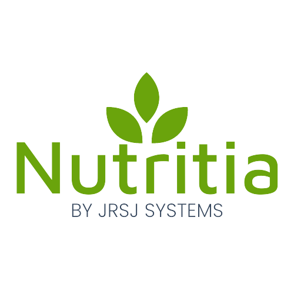

<p align="center">
    
    <h2 align="center">Workflow Aid for Nutritionists</h2>
    <p align="center">Nest.js API</p>
</p>
<hr>

## Environment Variables Example
```
JWT_SECRET=abc@123
DATABASE_HOST=localhost
DATABASE_PORT=3307
DATABASE_USER=root
DATABASE_PASSWORD=nutritia_password
DATABASE_SCHEMA=nutritia_db
RUN_MIGRATIONS=true
```

## Installation

```bash
$ npm install
```

## Running the app

```bash
# development
$ npm run start

# watch mode
$ npm run start:dev

# production mode
$ npm run start:prod
```

## Test

```bash
# unit tests
$ npm run test

# e2e tests
$ npm run test:e2e

# test coverage
$ npm run test:cov
```
